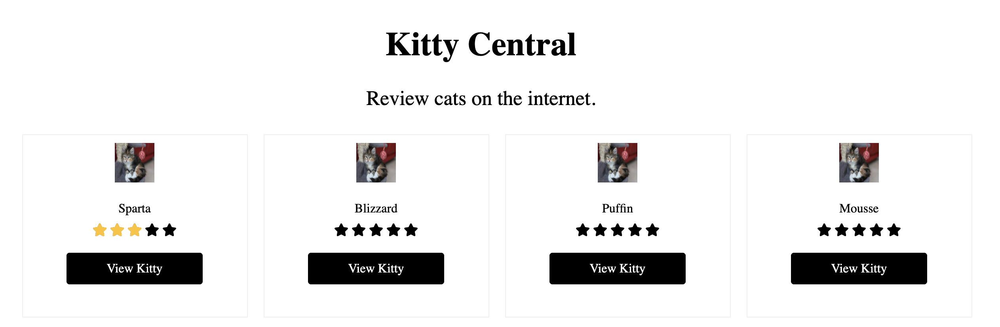

# Kitty Readme

## Getting Started

1. Clone this repo 
2. Install the ruby `rbenv install 2.7.1`
3. Install dependencies `bundle && yarn`
4. Start the server `rails s`
5. Initialize the database using `rakd db:create && rake db:schema:load`
6. Seed your database using `rake db:seed`
7. Navigate to your app at `http://localhost:3000/`